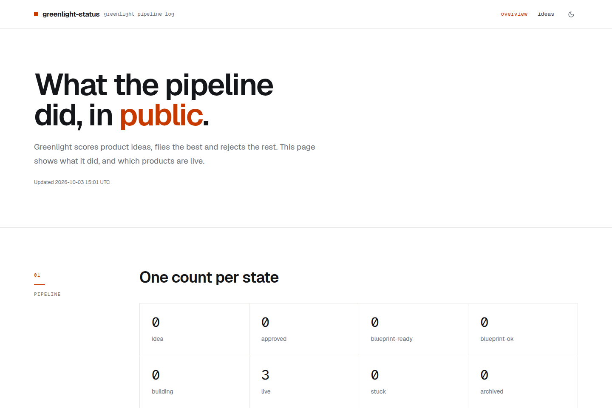
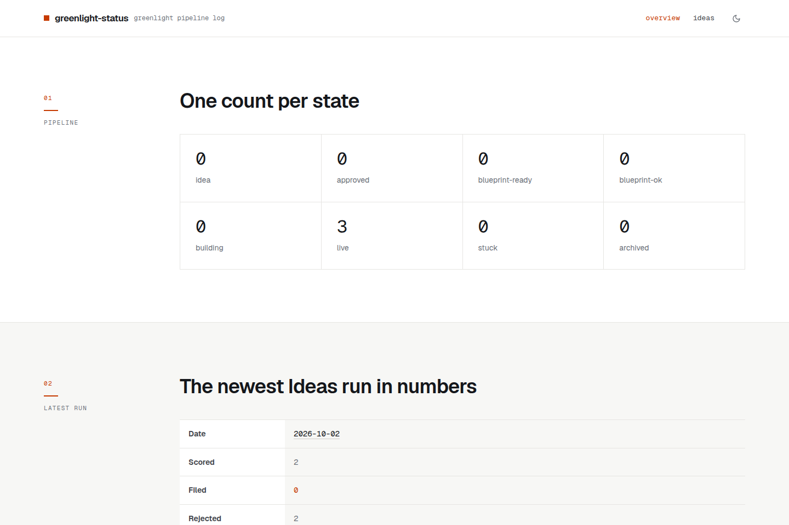
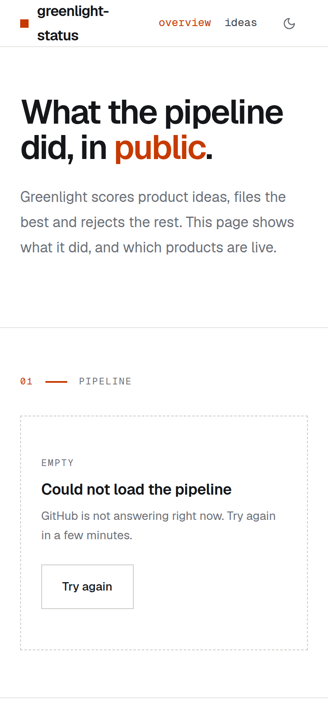

<!--
  The Factory fills in this README from blueprint.md (see CLAUDE.md → "README"). Replace every line in brackets;
  keep the section order. The greenlight:live and greenlight:screenshots blocks are written by the Publisher after
  each deploy (live link, screenshots of the live site): keep their markers and leave their contents alone.
-->

# greenlight-status

A read-only page showing what the Greenlight pipeline is working on, which ideas it scored and rejected, and which products are live.

<!-- greenlight:live -->
**[Open greenlight-status → greenlight-status.yangxdev.workers.dev](https://greenlight-status.yangxdev.workers.dev)**
<!-- /greenlight:live -->

<!-- greenlight:screenshots -->




<p align="center">

</p>

<sub>Screenshots of the live site, refreshed on every deploy.</sub>
<!-- /greenlight:screenshots -->

## What it does

- Shows one count per pipeline state: idea, approved, blueprint-ready, blueprint-ok, building, live, stuck and archived.
- Summarises the newest Ideas run: its date, how many cards were scored, filed and rejected.
- Lists the products that are live, with the latest verdict and the reason for it.
- Lists every card the Critic scored, newest run first, with four scores, the total and the verdict, then the watchlist of near misses.
- Links every row to its source file on GitHub.

## How to use it

1. Open the **overview** page to see the pipeline counts, the latest run and the live products.
2. Open **ideas** to read every scored card and the watchlist.
3. Follow a row's link to read the source file on GitHub.

Only the 100 newest issues are read, and only the first 100 comments of each live issue, so older ideas are not shown.

## Privacy

It stores nothing. The Worker reads public GitHub data and caches it in memory for ten minutes. There are no accounts and no tracking cookies; the only thing the browser remembers is your light or dark theme choice. Page views are counted by Cloudflare Web Analytics, which sets no cookies.

## Contributing

Open an issue if a number looks wrong, a page is confusing, or you want something added. Pull requests are welcome too.

## Run it locally

Needs Node.js 22.18 or later.

```bash
npm ci
npm run dev     # the app at http://localhost:5173 (the /api Worker is not running)
npm run check   # lint, tests and a production build
```

`npm run build && npx wrangler dev` serves the built app together with the `/api` Worker.

Two settings control where the Worker reads from:

- `SOURCE_REPO` is a plain variable in `wrangler.jsonc`. It defaults to `yangxdev/greenlight`.
- `GITHUB_READ_TOKEN` is an optional read-only GitHub token for public repositories. Without it GitHub's limit of 60 requests an hour per IP applies. Set it with `npx wrangler secret put GITHUB_READ_TOKEN`, or put it in `.dev.vars` locally.

## Built with

React 19, Vite, Redux Toolkit, React Router and Tailwind CSS v4, served by a Cloudflare Worker.

---

Made by [yangxdev](https://github.com/yangxdev). [MIT licensed](LICENSE.md).
